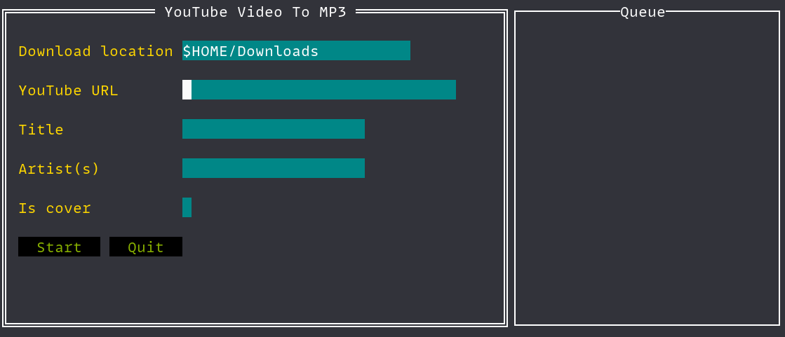

# ytmdl

> Terminal-based YouTube music downloader

## Feature

- A TUI application downloads YouTube videos into mp3 files.
- Creates album cover from video thumbnail.
- Currently only supports Linux (probably works on macOS, not tested). Not working on Windows due to encoding issues with UTF-8 characters.

## Dependency

- [ffmpeg](https://ffmpeg.org/download.html)
- [yt-dlp](https://github.com/yt-dlp/yt-dlp/releases/latest)
